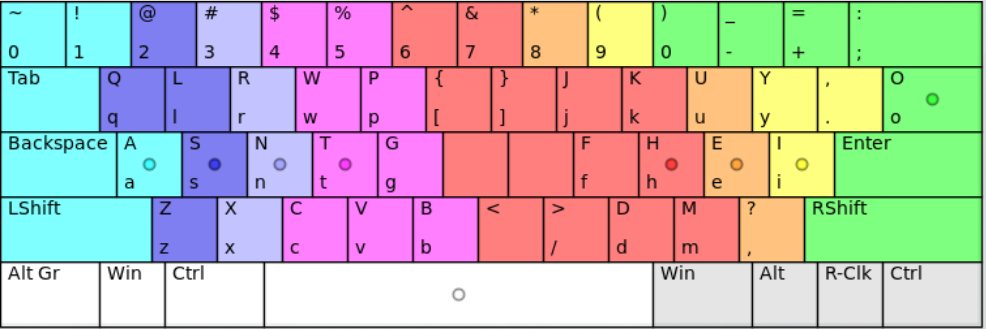

maxwell
=======

The Maxwell keyboard layout

### Installation

Testing:

`setxkbmap -option compose:caps ; xmodmap maxwell.layout`

This keyboard layout has no Caps lock. Instead, it uses the key as a [compose key](http://en.wikipedia.org/wiki/Compose_key). If you want to keep the Caps lock, you can just skip the `setxkbmap` command and use `xmodmap maxwell.layout` instead.

To permanently use the layout, you need to add the above command to your startup script, like ~/.xinitrc .

### Preview

What follows is *an estimate* of what the layout looks like. There are actually some differences. For example, this is made for keyboard that have backspace to the left of return, but this is not shown in the picture.

### Analysis

There's a tool for analyzing how well keyboard layouts perform on example texts. You can find it [here](http://patorjk.com/keyboard-layout-analyzer/#/config).

You can analyze this layout by clicking Import on that site, and pasting the contents of analysis.txt.

